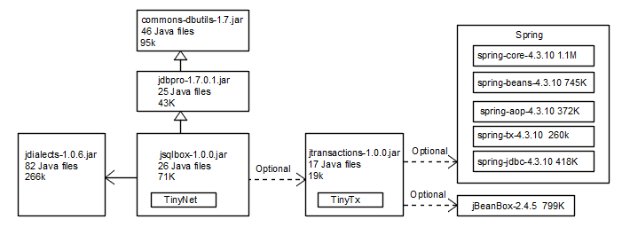

<tt>
  
## jSqlBox  
**License:** [Apache 2.0](http://www.apache.org/licenses/LICENSE-2.0)  
#### jSqlBox是一个Java持久层工具，设计目标是用来代替目前的Hibernate/MyBatis/JdbcTemplate/DbUtils等持久层工具。jSqlBox的主要特点:  
1. 模块化设计。 jSqlBox将Jdbc工具、事务、方言和数据库脚本生成等功能分成子模块，由不同的子项目实现，每个子项目都可以脱离jSqlBox存在，甚至可供其它ORM工具使用，避免重复发明轮子。同时jSqlBox的各个子模块(除TinyNet外)在开发中大量借签了其它成熟项目，例如，方言模块(jDialects)抽取了Hibernate的70种方言，事务模块(jTranscations)在提供简化版声明式事务的同时兼容Spring事务，底层数据库访问工具(jDbPro)基于Apache Commons DbUtils(以下简称DbUtils)，链式风格和模板的引入则分别受jFinal和BeetlSql启发。
2. 与DbUtils兼容，基于DbUtils开发的项目可以无缝升级到jSqlBox，享受到jSqlBox提供的高级功能如跨数据库开发、分页、模板、JPA注解支持、数据库脚本生成、ActiveRecord风格等。
3. 支持SQL写法多。得益于模块式架构，jSqlBox从最底层的JDBC到最新式的NoSQL式查询都有，是目前支持SQL写法最多的持久层工具。  
4. 学习曲线平滑、可维护性好。得益于模块化架构，jSqlBox项目的本体部分仅由13个Java类组成。持久层的工作被分散到各个子模块中去了，模块化设计带来的好处就是模块化学习，只要了解各个模块的功能，就能很快掌握jSqlBox的使用。最极端情况是DbUtils使用者可以无学习直接上手jSqlBox.
5. 多项技术创新，如Inline风格、动态配置、改进的链式风格、NoSQL自动越级查询及树结构查询等。

#### jSqlBox的开发目的是试图解决其它持久层的一些问题，主要有：
1. 架构有问题，重复发明轮子。其它持久层通常试图提供一篮子解决方案，但是不分模块的开发方式使得代码不可复用。例如Hibernate、MyBatis、jFinal、NutzDao、BeetlSql、JdbcTemplate等工具，都面临着如何处理跨数据库开发的问题，它们的做法要么就是自已从头到尾开始开发一套方言工具，要么就是干脆不支持数据库方言，没有借签其它工具的成果，也没有考虑将自己的成果分享给其它工具。
2. 过于偏执于某项技术，试图用一把锤子解决所有问题。例如Hibernate和JPA对象化设计过度，臃肿复杂。MyBatis的XML配置繁琐，没有提供CRUD方法(有插件改善，但总不如原生支持好）。JdbcTemplate和DbUtils偏重于SQL，开发效率低。BeetlSql完全围绕模板打转。jFinal和Nutz则对捆绑式推销情有独钟，没有将持久层独立出来，买个萝卜搭块糕。
3. 不支持动态配置。从数据库表到Java对象，称为ORM，这需要进行配置。但这些常见的持久层工具，不支持动态配置，这对于需要动态生成或修改配置的场合是个重大缺陷。例如JPA注解或XML配置的实体Bean，在运行期很难更改外键关联关系、数据库表映射关系配置。

#### jSqlBox的缺点
它太新了，诞生不到一个月(虽然陆陆续续在Github和码云上的开发时间已超过1年)，使用者少，设计缺陷和程序中的Bug都没有暴露出来，文档不完善，目前不建议在重要项目使用。

#### 如何在项目中引入jSqlBox?
在pom.xml中添加如下行:
```xml
<dependency>
    <groupId>com.github.drinkjava2</groupId>
    <artifactId>jsqlbox</artifactId>
    <version>1.0.0</version> 
</dependency>
``` 
Maven将自动下载jsqlbox-1.0.0.jar、jdbpro-1.7.0.1.jar、jdialects-1.0.6.jar、commons-dbutils-1.7.jar四个包。下图显示了各个包之间的依赖关系及包的大小以及源文件数量。


如需要配置事务，还需添加对jtransactions-1.0.0.jar的依赖，具体请参见jTransactions项目中的pom.xml文件。 


### jSqlBox快速入门
#### 第一个jSqlBox示例: 数据源设定、上下文生成、创建数据库表格、插入和读取内容
```Java
public class HelloWorld {
  @Id
  private String name;
  public String getName() {return name;}
  public void setName(String name) {this.name = name;}

  @Test
  public void doText() {
    HikariDataSource ds = new HikariDataSource();//边接池设定
    ds.setJdbcUrl("jdbc:h2:mem:DBName;MODE=MYSQL;DB_CLOSE_DELAY=-1;TRACE_LEVEL_SYSTEM_OUT=0");
    ds.setDriverClassName("org.h2.Driver");//利用H2内存数据库来进行单元测试
    ds.setUsername("sa");
    ds.setPassword(""); 

    SqlBoxContext ctx = new SqlBoxContext(ds); //jSqlBox上下文生成
    ctx.setAllowShowSQL(true);//打开jSqlBox的日志输出
    String[] ddls = ctx.getDialect().toCreateDDL(HelloWorld.class);//数据库DDL脚本生成
    for (String ddl : ddls)
      ctx.nExecute(ddl);//新建数据库表

    HelloWorld hello = new HelloWorld();
    hello.setName("Demo");
    ctx.insert(hello);//插入一行记录
    Assert.assertEquals("Demo", ctx.nQueryForObject("select name from helloworld"));
    ds.close();//关闭连接池
  }
}
```
运行一下单元测试，没有报错，说明数据库已成功插入了一行数据。
以上示例利用了jDialects的功能创建了数据库脚本并在jSqlBox中运行，创建了数据库表。jDialects支持15个主要的JPA注解，有9种主键生成方式，详情请见jDialects项目。在实际开发环境中，往往用Spring或jBeanBox之类的IOC工具配置连接池单例和SqlBoxContext单例，例如:
```Java
  SqlBoxContext ctx = BeanBox.getBean(CtxBox.class);//由IOC工具来获取SqlBoxContext单例 
```
利用IOC工具对各种常见数据库进行连接池的配置可详见单元测试的DataSourceConfig.java示例，因为我是jBeanBox的作者，所以用jBeanBox来演示，如果换成用Spring来配置也是一样的。

#### 分页
<br/> jSqlBox利用了jDialects进行跨数据库的(物理)分页，在出现SQL的地方，以下几种写法都可实现分页查询：
```Java
ctx.nQuery(new MapListHandler(), ctx.paginate(3, 5, "select * from users"));
ctx.nQuery(new MapListHandler(), SqlBoxContext.pagin(3, 5) + "select * from users");
ctx.nQuery(new MapListHandler(), "select * from users" + pagin(3,5));//静态引入方法
``` 

#### 动态配置
```Java
    User u=new User();
    u.tableModel().setTableName("user_tb2");//动态改变映射数据表名为"user_tb2"
    u.tableModel().fkey().columns("teamId").refs("team", "id");//动态给teamId字段添加外键约束
    u.columnModel("id").pkey();//动态设定数据库表中的id列为主键
    u.box().setContext(ctx2);//动态切换到新的上下文
    u.box().
    ...  
```    
以上示例中User继承于ActiveRecord类，拥有box()等方法，可以在运行期动态访问并改变User类对应的TableModel配置(见jDialects项目)。

#### 事务
jSqlBox项目本身不提供事务服务，而是利用jTransactions项目进行事务管理，这是一个包含了TinyTx和SpringTx两个事务实现的独立的事务服务工具。如果是从DbUtils移植过来的旧项目，也可保持原来的事务运作方式，因为jSqlBox与DbUtils兼容。

#### 重头戏 - jSqlBox支持的10种SQL写法:
SQL写法1 - DbUtils对JDBC的包装，手工负责连接的获取和关闭，获取连接用prepareConnection()方法，关闭连接用close(conn)方法。<br/>因为SqlBoxContext是DbUtils的QueryRunner类的子类，所以可以直接使用DbUtils的所有方法。
```Java
     Connection conn = null;
    try {
      conn = ctx.prepareConnection();
      ctx.execute(conn, "insert into users (name,address) values(?,?)", "Sam", "Canada");
      ctx.execute(conn, "update users set name=?, address=?", "Tom", "China");
      Assert.assertEquals(1L,
          ctx.queryForObject(conn, "select count(*) from users where name=? and address=?", "Tom", "China"));
      ctx.execute(conn, "delete from users where name=? or address=?", "Tom", "China");
    } catch (SQLException e) {
      e.printStackTrace();
    } finally {
      try {
        ctx.close(conn);
      } catch (SQLException e) {
        e.printStackTrace();
      }
    }
```

SQL写法2 - DbUtils对JDBC的包装之二，无需关心连接的获取和关闭，使用这种方式要注意SqlBoxContext的生成必须提供一个dataSource构造参数。
```Java
    try {
      ctx.execute("insert into users (name,address) values(?,?)", "Sam", "Canada");
      ctx.execute("update users set name=?, address=?", "Tom", "China");
      Assert.assertEquals(1L,
          ctx.queryForObject("select count(*) from users where name=? and address=?", "Tom", "China"));
      ctx.execute("delete from users where name=? or address=?", "Tom", "China");
    } catch (SQLException e) {
      e.printStackTrace();
    }
```

SQL写法3 - nXxxx()方法，从jDbPro项目开始新加入的方法，不用再捕捉SqlException异常。SqlException转化为运行时异常抛出，这种方式通常与支持声明式事务的AOP工具如Spring联用(下同)。
```Java
    ctx.nExecute("insert into users (name,address) values(?,?)", "Sam", "Canada");
    ctx.nExecute("update users set name=?, address=?", "Tom", "China");
    Assert.assertEquals(1L,
        ctx.nQueryForObject("select count(*) from users where name=? and address=?", "Tom", "China"));
    ctx.nExecute("delete from users where name=? or address=?", "Tom", "China");
```

SQL写法4 - iXxxx()方法，Inline风格，在SQL里直接写参数，参数暂存在Threadlocal中,SQL执行时自动转化为preparedStatement，这种方式的优点是被赋值的字段和实际参数可以写在同一行上,字段多时利于维护，也方便根据不确定的条件动态拼接SQL。这是始于jSqlBox的技术创新。
```Java
  ctx.iExecute("insert into users (", //
    " name ,", param0("Sam"), //SqlBoxContext.param0()方法的静态引入，下同
    " address ", param("Canada"), //
    ") ", valuesQuesions());
  param0("Tom", "China");
  ctx.iExecute("update users set name=?,address=?");
  Assert.assertEquals(1L, ctx
    .iQueryForObject("select count(*) from users where name=? and address=?" + param0("Tom", "China")));
  ctx.iExecute("delete from users where name=", question0("Tom"), " or address=", question("China"));
```

SQL写法5 - tXxxx()方法, 模板风格，利用模板来存放SQL变量:
```Java
    Map<String, Object> params=new HashMap<String, Object>();
    User sam = new User("Sam", "Canada");
    User tom = new User("Tom", "China");
    params.put("user", sam);
    ctx.tExecute(params,"insert into users (name, address) values(#{user.name},#{user.address})");
    params.put("user", tom); 
    ctx.tExecute(params,"update users set name=#{user.name}, address=#{user.address}");
    params.clear();
    params.put("name", "Tom");
    params.put("addr", "China");
    Assert.assertEquals(1L,
        ctx.tQueryForObject(params,"select count(*) from users where name=#{name} and address=#{addr}")); 
    params.put("u", tom);
    ctx.tExecute(params, "delete from users where name=#{u.name} or address=#{u.address}");
```

SQL写法6 - tXxxx()方法，模板风格和Inline风格的结合使用：
```Java
    user = new User("Sam", "Canada");
    put0("user", user);
    ctx.tExecute("insert into users (name, address) values(#{user.name},#{user.address})");
    user.setAddress("China");
    ctx.tExecute("update users set name=#{user.name}, address=#{user.address}" + put0("user", user));
    Assert.assertEquals(1L,
        ctx.tQueryForObject("select count(*) from users where ${col}=#{name} and address=#{addr}",
            put0("name", "Sam"), put("addr", "China"), replace("col", "name")));
    ctx.tExecute("delete from users where name=#{u.name} or address=#{u.address}", put0("u", user));
```

SQL写法7 - tXxxx()方法，依然是模板风格，但是运行期切换成使用另一个模板"NamedParamSqlTemplate"，采用冒号来作参数分界符。<br/>jSqlBox是一种开放式架构设计，它对事务、日志、模板都有缺省实现，但是也支持切换成其它第三方实现。
```Java
    user = new User("Sam", "Canada");
    ctx.setSqlTemplateEngine(NamedParamSqlTemplate.instance());
    put0("user", user);
    ctx.tExecute("insert into users (name, address) values(:user.name,:user.address)");
    user.setAddress("China");
    ctx.tExecute("update users set name=:user.name, address=:user.address" + put0("user", user));
    Assert.assertEquals(1L, ctx.tQueryForObject("select count(*) from users where ${col}=:name and address=:addr",
        put0("name", "Sam"), put("addr", "China"), replace("col", "name")));
    ctx.tExecute("delete from users where name=:u.name or address=:u.address", put0("u", user));
```

SQL写法8 - Data Mapper数据映射风格，与Hibernate中的写法一样。从性能方面考虑，jSqlBox强烈建议实体类继承于ActiveRecord类，但是对于纯粹的POJO类，jSqlBox也是支持的： 
```Java
    User user = new User("Sam", "Canada");
    ctx.insert(user);
    user.setAddress("China");
    ctx.update(user);
    User user2 = ctx.load(User.class, "Sam");
    ctx.delete(user2);
```

SQL写法9 - ActiveRecord风格，继承于ActiveRecord类的实体类，自动拥有insert/update/delete等CRUD方法和一个box()方法可用来在运行期动态更改配置。jSqlBox项目命名的由来即因为这个box()方法。 
```
    System.out.println("=== ActiveRecord style  ===");
    user = new User("Sam", "Canada");
    user.box().setContext(ctx);// set a SqlBoxContext to entity
    user.insert();
    user.setAddress("China");
    user.update();
    user2 = user.load("Sam");
    user2.delete();
```
以下是ActiveRecord风格的一个变种，使用这种写法的前提是必须在程序启动时调用SqlBoxContext.setDefaultContext(ctx)方法设定一个全局缺省上下文，适用于单数据源场合。这种写法的优点是业务方法里完全看不到持久层工具的影子: 
```Java
    user = new User("Sam", "Canada").insert();
    user.setAddress("China");
    user.update();
    user2 = user.load("Sam");
    user2.delete();
```

SQL写法10 - 链式风格，严格来说这种风格还是应该归类于ActiveRecord模式。
```Java
   链式风格之一：
   new User().put("id","u1").put("userName","user1").insert(); 
   
   链式风格之二：
   new Address().put("id","a1","addressName","address1","userId","u1").insert();
   
   链式风格之三：
   new Email().putFields("id","emailName","userId");
   new Email().putValues("e1","email1","u1").insert();
   new Email().putValues("e2","email2","u1").insert();   
```
注：如果有大批的插入、更新语句，可以在开始前调用ctx.nBatchBegin()方法，结束后调用ctx.nBatchEnd方法，则插入方法将自动汇总成批量操作，不过使用此功能的前提是数据库要支持批量操作功能(如MySQL要设定rewriteBatchedStatements=true)。

#### NoSQL查询
下面要介绍的是jSqlBox项目中的NoSql式查询方法，对于下图的一组关系数据库表格，User与Role是多对多关系，Role与Privilege是多对多关系，UserRole和RolePrivilege是两个中间表，用来连接多对多关系。如果用普通的SQL进行多表关联查询比较麻烦，jSqlBox中包含了一个TinyNet子项目，专门用于将关系数据库转化为内存中的图结构，从而可以运用NoSql式查询方法，在节点间浏览查询。


NoSql查询示例1 一 查找u1和u2两个用户所具有的权限
```Java
    TinyNet net = ctx.netLoad(new User(), new Role(), Privilege.class, UserRole.class, RolePrivilege.class);
    Set<Privilege> privileges = net.findEntitySet(Privilege.class,
        new Path("S-", User.class).where("id=? or id=?","u1","u2").nextPath("C-", UserRole.class, "userId")
            .nextPath("P-", Role.class, "rid").nextPath("C-", RolePrivilege.class, "rid")
            .nextPath("P+", Privilege.class, "pid"));
    for (Privilege privilege : privileges)
      System.out.print(privilege.getId()+" ");
      
    输出结果：p1 p2 p3 
```
说明:
* netLoad方法将根据所给参数，调入所在表的所有内容，在内存中拼成TinyNet实例代表的图状结构。注意TinyNet不是线程安全类，在多线程环境下使用要小心。
* 与netLoad方法类似的一个方法是netLoadSketch方法，不是将全表加载，而是只加载所有主键和外键字段，这种懒加载可以提高性能并节约内存。
* Path用于定义一个查找路径，构造器的第一个参数由两个字母组成，首字母S表示查找当前节点，P表示查找父节点，C表示查找子节点。第二个字母"-"表示查找的中间结果不放入查询结果，"+"则放入查询结果，"*"表示递归当前路径查找所有节点并放入查询结果。第二个参数定义目标对象类、类实例或数据库表名，第三个参数为可变参数，为两个目标之间的关联属性或关联列(即单外键或复合外键的列名)，例如User和UserRole之间的关联字段为"userId"。
* Path的where()方法定义一个表达式，用于判断节点是否可以选中，表达式支持的关键字有: 当前实体的所有字段名、>、 <、 =、 >、=、 <=、 +、 -、 *、/、null、()、not 以及 equals、contains等常见字符串函数，详见手册或单元测试源码。
* Path的nextPath()方法用于定义下一个查找路径。

NoSql查询示例2 一 自动越级查询。示例1的写法比较啰嗦，下面是等价写法，用autoPath方法可以自动计算出搜索路径，从而实现越级查询：
```Java
    TinyNet net = ctx.netLoad(new User(), new Role(), Privilege.class, UserRole.class, RolePrivilege.class);
    Set<Privilege> privileges = net.findEntitySet(Privilege.class,
        new Path(User.class).where("id='u1' or id='u2'").autoPath(Privilege.class));
    for (Privilege privilege : privileges)
      System.out.print(privilege.getId()+" ");
```
注意autoPath方法仅适用于查找路径唯一的情况，如果从User到Privilege有多个不同路径通达，就不能应用autoPath方法，而必须写出全路径。

NoSql查询示例3 一 Java原生方法判断。用Java原生方法进行节点的判断，可以利用熟悉的Java语言而且支持实体字段的重构。以下示例查询Email "e1"和"e5"所关联的权限:
```Java
  @Test
  public void testAutoPath2() {
    insertDemoData();
    TinyNet net = ctx.netLoad(new Email(), new User(), new Role(), Privilege.class, UserRole.class,
        RolePrivilege.class);
    Set<Privilege> privileges = net.findEntitySet(Privilege.class,
        new Path(Email.class).setValidator(new EmailValidator()).autoPath(Privilege.class));
    for (Privilege privilege : privileges)
      System.out.println(privilege.getId());
    Assert.assertEquals(1, privileges.size());
  }

  public static class EmailValidator extends DefaultNodeValidator {
    @Override
    public boolean validateBean(Object entity) {
      Email e = (Email) entity;
      return ("e1".equals(e.getId()) || "e5".equals(e.getId())) ? true : false;
    }
  }
```

NoSql示例4  手工加载。 TinyNet的加载也可以手工按需加载，而不是用netLoad方法全表调入，例如下表运行两个SQL，分两次查询数据库并将结果合并成一个TinyNet实例：
```Java
    List<Map<String, Object>> mapList1 = ctx.nQuery(new MapListHandler(netProcessor(User.class, Address.class)),
        "select u.**, a.** from usertb u, addresstb a where a.userId=u.id");
    TinyNet net = ctx.netCreate(mapList1);
    Assert.assertEquals(10, net.size());

    List<Map<String, Object>> mapList2 = ctx.nQuery(new MapListHandler(),
        netConfig(Email.class) + "select e.** from emailtb as e");
    ctx.netJoinList(net, mapList2);
    Assert.assertEquals(15, net.size());
```
上例中两个星号这种写法是jSqlBox项目中唯一打破标准SQL写法的地方，它表示查询User对象所有非transient属性所对应的数据库表字段。

NoSql查询示例5 一 树结构的查询，对于Adjacency List模式存储的树结构数据表，利用NoSQL查询非常方便，例如如下数据库表格：

查询B节点和D节点的所有子节点(含B和D节点本身)：
```Java
    TinyNet net = ctx.netLoad(TreeNode.class);
    Set<TreeNode> TreeNodes = net.findEntitySet(TreeNode.class,
        new Path("S+", TreeNode.class).where("id=? or id=?", "B", "D").nextPath("C*", TreeNode.class, "pid"));
    for (TreeNode node : TreeNodes)
      System.out.print(node.getId() + " ");
    输出: B D E F H I J K L 
```

查询F节点和K节点的所有父节点(不含F和K节点本身)：
```Java
    TinyNet net = ctx.netLoad(TreeNode.class);
    Set<TreeNode> TreeNodes = net.findEntitySet(TreeNode.class,
        new Path("S-", TreeNode.class).where("id='F' or id='K'").nextPath("P*", TreeNode.class, "pid"));
    for (TreeNode node : TreeNodes)
      System.out.print(node.getId() + " ");
    输出: B H A D 
```
对于海量数据的大树，用netLoad方法调入全表到内存再用NoSQL方法查询是不现实的，这时可利用数据库的递归查询功能将一棵子树查找到内存中再用NoSQL方法查询。如果数据库不支持递归或有性能问题，也可参照本人发明的无限深度树方案的第三种方案（见http://drinkjava2.iteye.com/blog/2353983 ），可以仅用一条SQL语句查询出所需要的子树调入内存中。 

对了，最后说一下，可能有人已经注意到，在上面的示例中，什么一对多，多对多之类其它ORM工具必不可少的配置在哪里? 答案是：还记得一开始动态配置的示例演示中，有这么一句么: u.tableModel().fkey().columns("teamId").refs("team", "id"); 这就是多对一配置了，还有一个FKey注解也是干同样的事，表示给user数据库表的teamId列添加数据库外键，参考team表的id主键字段。外键就是关系，这是为什么关系数据库被称为关系数据库，关系数据库只存在"多对一"这种唯一的关联，所以jSqlBox中没有什么多对多、一对多的配置，完全是基于传统的ER建模。jSqlBox支持复合主键和复合外键(详见jDialects项目)。程序员在运行期可以在程序里自由地添加或删除实体的外键约束配置(每个实体的配置都是固定配置的副本，只要不调用toCreateDDL方法生成脚本并执行，对实际数据库是没影响的)，从而可以自由地创建对象间的关联，然后就可以用NoSQL方式查询了。另外说一下:NoSql查询是在不同类型的节点间浏览，所以返回结果也可以是不同的实体类，因篇幅原因就不在这里演示了。

以上即为jSqlBox的初步介绍，欢迎大家试用和挑错，同时也欢迎有兴趣者加入开发组。PDF使用手册正在制作中。目前如有兴趣试用的话，可参考本文介绍和单元测试源码来了解本项目。

#### 附录 - 性能测试。
以下是jSqlBox不同SQL写法进行循环10000次CRUD操作的性能测试(单元测试源码SpeedTest.java)，在H2内存数据库上跑(i3 2.4G)，可以排除磁盘读写带来的影响，反映框架出本身的性能。从测试结果可以看出各种写法除了模板方法有点慢外，基本与纯JDBC相差不大。
```
Compare method execute time for repeat 10000 times:
                    pureJdbc:  0.983 s
       dbUtilsWithConnMethod:  0.890 s
         dbUtilsNoConnMethod:  0.968 s
               nXxxJdbcStyle:  0.953 s
             iXxxInlineStyle:  1.248 s
           tXxxTemplateStyle:  3.714 s
  tXxxTemplateAndInlineStyle:  3.589 s
tXxxNamingParamTemplateStyle:  3.730 s
             dataMapperStyle:   2.91 s
           activeRecordStyle:  1.687 s
  activeRecordDefaultContext:  1.702 s
```
这个测试不包含NoSQL式查询，因为NoSql在本项目中目前只有查询方法，没有写方法，所以未加入对比测试。但是NoSql并不意味着性能低，因为是纯内存查询，而且在jSqlBox中，已经实现当节点之间有重复固定的查询时，会在节点之间形成缓存，查询性能反而可能比普通的SQL查询高出很多(目前jSqlBox项目中普通SQL的查询缓存还未开发)。  

</tt>
