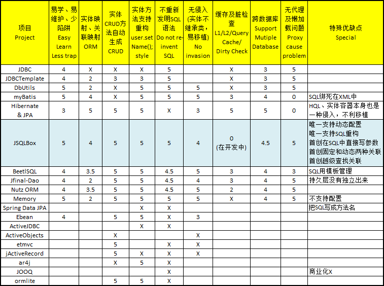
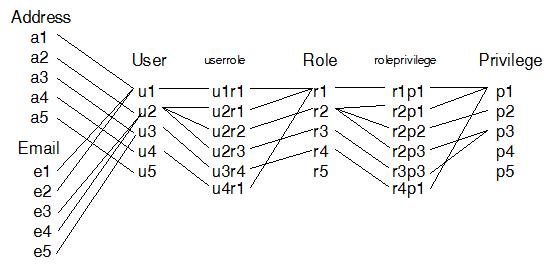

(English version see "README-English.md")

## jSqlBox (In Developing)
**License:** [Apache 2.0](http://www.apache.org/licenses/LICENSE-2.0)  

jSqlBox是一个微型的、易学易用的、支持简单的O-R映射的持久层工具,目标是用来代替功能强大但过于复杂的Hibernate,以及一些相对简单但功能不尽人意的持久层工具如MyBatis/JDBC/JDBCTemplate/DButils/EBean/OpenJPA/jFinal/jActiveRecord/ActiveJDBC/JOOQ/BeetlSQL/NutzDao等。目前jSqlBox项目尚未完全开发完成,欢迎有兴趣者试用或加入开发组。 

一张对比图显示jSqlBox项目的定位和开发目标：(打分仅为个人看法,0到5分制, 0~5分,X号表示重大缺陷,只要有X号即不推荐使用）  
  
上表只是对软件架构方面的一个比较。速度、可靠性、开发进度、日志、文档、覆盖测试等指标不在比较范围内,因为开源项目用的人多了,这些属于软件质量上的问题自然会日益改进,但是如果因为设计思路的问题,造成易用性和可维护性上存在缺陷,则无论怎样改进软件质量也是无法弥补的。  

### 为什么要开发jSqlBox?
因为作者发现了一种利用Java初始块来代替XML和Annotation配置的方法(即"BOX"模式,详见jBeanBox项目),凡是利用XML和Annotation作为配置文件的项目,都存在着XML和Annotation不够灵活,配置文件不能动态生成、修改的问题,这对于需要动态生成或修改配置的场合是个致命缺陷。作者在完成jBeanBox项目后,发现Hibernate和MyBatiis这两个流行的持久层工具也都存在这个问题,这是jSqlBox项目产生的原因。简单说,jSqlBox的开发目标就是一个支持动态配置的持久化工具。这是一个先有了锤子,再找钉子的项目,Hiberante和MyBatis就是这个项目的两个钉子。  
开发之前,作者研究了Hibernate存在的一些问题,主要归纳如下:  
1)如前所述,配置是固定的,不能动态变化,对于需要在运行期动态创建或改变数据源、数据表、列名、映射方式的场合,解决起来比较麻烦。  
2)缺省情况下,实体类为容器管理,导致任何对PO的更改都会写入数据库,这使得PO不能与VO共享字段,PO不能当成VO简单地传递到View层使用。  
3)HQL语言是对SQL的包装,属于重新发明轮子,虽然HQL是操纵对象的,但是具有讽刺意味的是:HQL语言本身不是面向对象的,不支持IDE拼写检查和重构。(顺便说一下MyBatis和BeetlSql这个两个项目,前者将SQL写在XML中,后者将SQL写在模板语言中,虽然灵活性较高,可以自定义一些特殊语法,但是IDE的重构功能对于XML和模板语言不起作用,一旦数据库字段变动,将不得不手工检查和修改大量SQL,这是一个繁重且可能出错的工作。)  
4)过度复杂,源码庞大(超过3千个类)。虽然号称无侵入的轻量级框架,但HQL和实体管理容器本身就是一种入侵,采用了这种架构的项目就绑死在了实体容器这种复杂的工具上了。  

jSqlBox虽然最初目的是给Hibernate加一个动态配置,但考虑到实体容器开发及使用的复杂性,以及个人水平有限,借鉴了MyBatis的做法,即在运行期如需用到OR映射时,在程序中动态配置并完成OR转换。与MyBatis不同的是jSqlBox在易用性上作了极大改进,取消了繁琐的XML配置和注解,简单的CRUD之类SQL更不必手工创建。与目前流行的一些小众持久层工具相比,jSqlBox则胜在体积虽小功能齐全,例如:无XML、无注解、动态配置、CRUD方法、ORM、动态关联、越级查找关联、跨数据库、分页、多种主键生成、对象及查询缓存、支持SQL重构、首创SQL内直接写参数等,很多微型持久层工具都缺少若干项这些对易用性、可维护性非常关键的特性。

### jSqlBox主要特点介绍:
*简单,目前只有约30个Java类,是一个能够轻松架驭的微型工具,学习、维护、二次开发都很容易。  
*提供CRUD方法,简单的CRUD操作占持久层大半的工作量,对一个持久层工具来说自动生成CRUD方法是必须提供的基本功能。  
*基于ActiveRecord模式,无Session的显式注入。支持多上下文。但当仅有一个数据源时,鼓励运用全局缺省上下文来简化配置。  
*低侵入,PO类只需要声明实现Entity接口即可(仅适用于Java8及以上,对于Java7及以下需要继承自EntityBase基类)。  
*没有XML,没有注解,没有脚本,没有模板语言,具有静态语言特性的Java本身就是一种完美的配置文件,它强大、灵活、面向对象、支持IDE拼写检查和重构,飞速启动(因为已经编译成字节码,无需象XML那样在运行期解析）。  
*不重新发明SQL语法,直接使用原生SQL。  
*对SQL的包装,jSqlBox首创利用ThreadLocal将字符串拼接的SQL参数自动包装成preparedStatement,防止SQL注入,精简代码,提高可维护性。  
*支持原生SQL重构(但不强迫)。数据库列名变动、PO类字段变动等借由IDE的重构功能来管理,不需要手工检查已存在的SQL,保证了SQL的健壮性。   
*无配置,默认按Java Bean命名规则,PO类自动适应数据库表,字段自动匹配驼峰式或下划线式数据表列名,无需配置。  
*可配置,当数据库表名、字段名与缺省匹配规则不一致时,可用配置的方式来解决,配置为同目录或内嵌的"类名+Box"的Java类,也可将配置写在类初始化块中。  
*多配置和动态配置,同一个PO可采用不同的配置以进行多种方式的存取,配置可以继承重用已有的配置,配置可以在运行期动态生成和修改,与jBeanBox项目配置类似。  
*支持多种主键生成方式,与Hibernate/JPA类似,目前支持9种主键生成方式,也可自定义主键生成类。  
*支持多主键,适于使用了业务多主键的数据库。  
*(待开发)一级缓存与脏检查,与Hibernate类似,提供以ID为主键的行级缓存,一级缓存在跨越多个方法的同一事务中有效,对PO的存取不再重复访问数据库。与Hibernate的区别在于jSqlBox一级缓存比较简单,只缓存实体,包括已修改过的,不缓存CRUD命令。  
*(待开发)二级缓存和查询缓存,类似于Hibernate的缓存设计,可配置第三方缓存工具如EHcache等。  
*跨数据库的分页SQL和DDL支持。采用了jDialects项目，支持包括Hibernate的所有方言在内的70多种数据库方言。jDialects是一个独立的、从Hibernate中抽取的SQL方言工具，可以使用在任何用到了原生SQL和JDBC的场合。
*目前jSqlBox内核建立在JDBCTemplate基础上，事务借用Spring的声明式事务。一些特殊的需求可以通过直接调用内核的JdbcTemplate来实现,内核建立在JdbcTemplate上是因为它的声明式事务与JdbcTemplate结合紧密,目前找不到其它更方便、好用、成熟的类似Spring的声明式事务。  
*(正在考虑中)内核考虑采用纯JDBC/DbUtils/JDBCTemplate三种内核模式，分别应用于不同的场合。  
*不使用代理类，不会有代理类造成的希奇古怪的问题。没有懒加载，没有OpenSessionInView问题, PO类可以直接充当VO传递到View层,PO在View层事务已关闭情况下,依然可以继续存取数据库(工作在自动提交模式,但通常只读)。  
*提供简单的O-R映射,有一对一,一对多,树结构三种映射类型,多对多可由两个一对多组合成。支持固定、动态关联和越级自动查找关联功能。  
*(开发计划)考虑到有人喜欢将SQL集中放在一起管理（尤其是很长的SQL)， 将提供简单的模板功能演示。jSqlBox是建立在执行原生SQL基础上，没有发明新的SQL语法，所以和使用模板不冲突，目前用什么模板还未确定。(正在研究是否可以直接用JSP来当SQL模板，这样就能直接利用某些IDE对JSP的查错和重构支持)  

### jSqlBox缺点:
*比较新,缺少足够测试、文档、缺少开发和试用者(欢迎在个人项目中试用或加入开发组,任何问题和建议都会促使它不断完善)。  
*实体映射比较简单,不支持多重嵌套映射和懒加载;只支持单向从数据库读取并装配成对象树,不支持对象树更新到数据库,必须手工进行处理。  
*暂不支持Blob,Clob类型的包装,待今后版本加入,目前可利用内核的JDBCTemplate来进行Blob,Clob字段的存取。  
*暂无分库、分表、读写分离等功能，待今后考虑加入。  

### 如何使用jSqlBox?
(待上传)在项目的pom.xml中加入:
```
<dependency>
    <groupId>com.github.drinkjava2</groupId>
    <artifactId>jsqlbox</artifactId>
    <version>1.0.0.jre8</version> 
</dependency>
```
注:目前只有Java8版本,待项目稳定后将同时发布Java7和Java8两个版本,它们的唯一差别是Java7的实体类必须继承于EntityBase类,而Java8的实体类只需要声明实现Entity接口即可。  

### 如何将jSqlBox项目导入Eclipse(对于开发者)?
1)安装JDK8或以上、 Git bash、 Maven, 在命令行下运行：  
2)git clone https://github.com/drinkjava2/jSqlBox  
3)cd jsqlbox  
4)mvn eclipse:eclipse  
5)打开Eclipse, 按"import"->"Existing Projects into Workspace", 选中jsqlbox目录, 即可将项目导入,注意导入时不要勾选“Copy to project folder”   

jSqlBox快速入门：
---
示例 1 - 入门示例: 数据源设定、上下文设定、实体创建和写入数据库
```
	public static void main(String[] args) {
		ComboPooledDataSource ds = new ComboPooledDataSource();//c3p0池设定
		ds.setUser("root");
		ds.setPassword("root888");
		ds.setJdbcUrl("jdbc:mysql://127.0.0.1:3306/test?rewriteBatchedStatements=true&useSSL=false");
		ds.setDriverClass("com.mysql.jdbc.Driver"); 
		
        //SqlBoxContext类似于Hibernate中的SessionFactory
		SqlBoxContext ctx = new SqlBoxContext(ds);//生成上下文实例
		User u = ctx.create(User.class); //默认User映射到USERS或USER数据库表,不分大小写,如果两个都找到则报错
		u.setUserName("User1"); //默认映射到USERNAME或USER_NAME列,不分大小写,如果两个同时都找到则报错
		u.setAddress("Address1");  
		u.insert(); //保存到数据库 
	} 
```

示例 2 - 用Spring或jBeanBox之类IOC工具来注入上下文, 关于jBeanBox项目详见拙作https://github.com/drinkjava2/jBeanBox
```
	public static void main(String[] args) {
		SqlBoxContext ctx = BeanBox.getBean(CtxBox.class);//由IOC工具来注入一个上下文单例
		User u = ctx.create(User.class);
		u.setUserName("User1");
		u.insert(); 	 
	} 
```

示例 3 - 使用缺省上下文。虽然jSqlBox项目支持多上下文,但对于绝大多数单数据源的应用, 鼓励使用全局上下文以简化编程
```
	//系统启动时,预先设定好全局唯一的缺省上下文
 	SqlBoxContext.setDefaultSqlBoxContext(BeanBox.getBean(DefaultSqlBoxContextBox.class));
	
	public static void main(String[] args) {
		User u = new user();//用new方法创建的实体,默认使用全局唯一的缺省上下文
		u.setUserName("User1");
		u.setAddress("Address1");
		u.insert(); 	 
	} 
```
		
示例 4 - 动态配置
```
		Customer c = new Customer().configAlias("c"); //动态配置SQL别名为"c"
		c.box().setContext(ctx2);//动态配置上下文为ctx2
		c.box().configTable("customer2"); //动态配置数据库表名为"customer2"
		c.box().configColumnName("customerName","cname2");//动态配置customerName的列名为"cname2"
		c.box().configMapping(oneToMany(), c.ID(), a.CID(), bind());//动态添加一个一对多关联
		c.setCustomerName('张三');
		...	
```		
示例 5 - 在SQL里直接写参数,参数暂存在Threadlocal中,SQL执行时自动转化为preparedStatement
```
    Dao.execute("update users set", //  
            " username=?", empty("Peter"), //  
            ",address=? ", empty("Nanjing"), //  
            " where age=?", empty(40));  
    Dao.execute("update users set", //  
            " username=", q("Jeffery"), //  
            ",address=", q("Tianjing"), //  
            " where age=", q(50));  
    Dao.execute("insert into users ", //  
            " (username", empty("Andy"), //  
            ", address", empty("Guanzhou"), //  
            ", age)", empty("60"), //  
             SqlHelper.questionMarks());  
```
其优点在于要被赋值的字段和实际参数写在同一行上,便于维护，这一点很重要！如果字段很多的话(>10行),就能看出好处了,直接删除添加一行就好了,不用担心删除添加错位置,问号和参数不配对，普通SQL维护困难主要是两个原因:1）SQL写在一行，添加和删除字段时不方便 2)参数的代入和问号的匹配要非常小心，不能搞串了，即使使用命名参数来避免问与的问题，也是一种比较繁琐的做法。
上面示例的empty()方法返回一个空字符,q方法返回一个问号,参数通过Threadlocal暂存传给Dao的execute方法使用,更多介绍可见贴子: http://www.iteye.com/topic/1145415

示例 6 - 快速插入：批量插入10000行数据,耗时~5秒,同样sql自动转为preparedStatement(防止Sql注入)
```
    public void tx_batchInsertDemo() {  
        for (int i = 6; i < 100000; i++)  
            Dao.cacheSQL("insert user (username,age) values(",q("user"+i)+",",q(60),")");  
        Dao.executeCatchedSQLs();  
    }  
```

示例 7 - 一个动态拼接SQL进行条件查询的例子,不存在Sql注入安全问题
```
	public int conditionQuery(int condition, Object parameter) {
		User u = new User();
		String sql = "Select count(*) from " + u.table() + " where ";
		if (condition == 1 || condition == 3)
			sql = sql + u.USERNAME() + "=" + q(parameter) + " and " + u.ADDRESS() + "=" + q("Address1");
		if (condition == 2)
			sql = sql + u.USERNAME() + "=" + q(parameter);
		if (condition == 3)
			sql = sql + " or " + u.AGE() + "=" + q(parameter);
		return Dao.queryForInteger(sql);
	}  
```
以上三个示例5、6、7不属于jSQLBox的关键特性，只是本人推荐的一种编程风格，使用了其它持久层工具的项目也可以借签。

示例 8 - 事务支持, 直接利用Spring的事明式事务,详见test\function_test\transaction目录下jBeanBox和Spring的两种配置示例
```
	@AopAround(SpringTxInterceptorBox.class) //方法将包装在事务中
	public void insertUser() {
		User u = new User(); 
		u.setUserName("User2");
		u.setAddress("Address2");		 
		u.setAlive(true); 
		u.insert(); 
	} 

	public static void main(String[] args) {
		InsertTest t = BeanBox.getBean(InsertTest.class); //获取代理实例
		t.insertUser();  
	}

```

示例 9 来看一下实体类的写法,没有JPA注解,不继承任何基类,但必须声明实现Entity接口(适用于Java8), 声明实现一个接口在Java8中是一种低侵入,因为不用实做任何方法,直接使用Java8接口的默认方法即可。
```
public class User implements Entity{ 
	private String id;//取名为"id"的字段默认即为实体ID
	private String userName;
	private String phoneNumber;
	private String address;
	private Integer age;
	private Boolean active;
	//Getter & Setter 略

	{
	//this.box().configEntityIDs("id");//这句代码可以省略,因为"id"字段默认即为实体ID
	//configEntityIDs方法可以有多个参数,用于多主键场合,详见LoadTest.java测试示例
	this.box().configIdGenerator("id", UUIDGenerator.INSTANCE));//配置ID为UUID类型
	}
	
	//以下方法不是必须的,但是jSqlBox建议具有,以实现对SQL重构的支持:
	public String ID() {
		return box().getColumnName("id");
	}

	public String USERNAME() {
		return box().getColumnName("userName");
	}

	public String PHONENUMBER() {
		return box().getColumnName("phoneNumber");
	}

	public String ADDRESS() {
		return box().getColumnName("address");
	}

	public String AGE() {
		return box().getColumnName("age");
	}

	public String ACTIVE() {
		return box().getColumnName("active");
	}
}
```
jSqlBox目前有9种主键生成策略, 并可方便地自定义主键生成类,详见单元测试及源码的id子目录。  在示例7中用到了u.table()、u.ADDRESS()之类的方法,这就是jSqlBox支持Sql重构的秘密,每个实体类的每个属性都有一个对应的大写的同名方法,在SQL中调用这个方法而不是直接写数据库表的字段名,通过这种方式将数据库字段与Java方法耦合,从而实现SQL支持重构。这种大写方法不是强制的,可用也可以不用,如果不在乎SQL是否支持重构,可以不写。

示例 10 - Box配置类: User类数据库的表名和字段是可配置的,只要在User类同目录下放一个名为UserBox的类即可,配置类支持继承。配置实例可在运行期调用box()方法获得并更改,这与jBeanBox项目类似。
```
public class UserBox extends SqlBox {
	{
		this.setBeanClass(User2.class);
		this.configTableName("usertable2");
		this.configColumnName(User.UserName, "User_Name2");
		this.configColumnName(User.Address, "Address2");
		this.configColumnName(User.PhoneNumber, "Phone2");
	}
}
```
也可以直接在类的初始化块中用this.box()方法来获取配置类实例进行配置。配置实例和实体实例的关系是一对一的,每一个实体实例都拥有属于自已的配置。

示例 11 - 一对一关联映射。  
实现关联映射的目是是将SQL查询获得的平面的、有冗余信息的一行行数据在内存中装配成互相关联的对象树结构,以方便程序做进一步处理,数据库中存储的内容在逻辑上本来就是树结构的(一对一，一对多等)，但是因为SQL的缘故，利用SQL查询获取的数据总是一行一行的，行与行之间总是存在冗余信息，关联映射的目的就是消除这些冗余信息，将数据在内存中还原成树结构。jSqlBox支持直接在SQL中进行关联关系配置，以下为一对一映射示例：  
```
        User u = new User();  
        Address a = new Address();  
        List<User> users = Dao.queryForEntityList(User.class, select(), u.all(), ",", a.all(), from(), u.table(), ",",  
                a.table(), " where ", oneToOne(), u.ID(), "=", a.UID(), bind());  
        for (User user : users) {   
            Address address = user.getChildNode(Address.class);   
            User user2 = address.getParentNode(User.class);  
            Assert.assertTrue(user == user2);  //true
        }  
```
说明一下：以上示例中bind()方法无参数,表示这是一个动态关联,User实例要找到关联的子类Address实例,必须用getChildNode方法。Address要找到它的父类,必须调用getParentNode方法。 all()方法表示在SQL中返回所有字段,只用调用了all()方法的类才会被拼装成对象。如果只是要返回个别字段而不是对象,可以考虑用queryForList方法,详见ListQueryTest.java测试示例。  

示例 12 - 一对多关联映射:
```
		User u = new User();
		Email e = new Email();
		List<User> users = Dao.queryForEntityList(User.class, select(), u.all(), ",", e.all(), from(), u.table(), ",",
				e.table(), " where ", oneToMany(), u.ID(), "=", e.UID(), bind(u.EMAILS(), e.USER()));
		for (User user : users) {
			Set<Email> emails = user.getEmails();
			for (Email email : emails) 
				Assert.assertTrue(email.getUser() == user);
		}
```
User与Email的关系为一对多,bind()方法有参数,表示这是一个固定关联,User类中必须定义一个emails集合类型字段,Email中必须定义一个User类字段,user实例查找email子类时只需要用getEmails()方法即可,email实例查找User父类只需要用getUser()方法即可。固定关联和动态关联各有利弊。前者有冗余(因为同一组信息在内存中出现两次,每个子类本身就指向了父类，父类中又重复性地关联了一遍子类，冗余会导致不一致带来的复杂性)，后者速度慢，每次父类要找子类时，都要在内存中遍历一遍。具体选哪个要看个人喜好了。

示例 13 - 多对多关联映射:
```
		User u = new User();
		Role r = new Role();
		Privilege p = new Privilege();
		UserRole ur = new UserRole();
		RolePrivilege rp = new RolePrivilege();
		Dao.getDefaultContext().setShowSql(true);//SQL日志输出
		List<User> users = Dao.queryForEntityList(User.class,
				u.pagination(1, 10, //
						select(), u.all(), ",", ur.all(), ",", r.all(), ",", rp.all(), ",", p.all(), from(), u.table(), //
						" left join ", ur.table(), " on ", oneToMany(), u.ID(), "=", ur.UID(), bind(), //
						" left join ", r.table(), " on ", oneToMany(), r.ID(), "=", ur.RID(), bind(), //
						" left join ", rp.table(), " on ", oneToMany(), r.ID(), "=", rp.RID(), bind(), //
						" left join ", p.table(), " on ", oneToMany(), p.ID(), "=", rp.PID(), bind(), //
						" order by ", u.ID(), ",", r.ID(), ",", p.ID()));
		for (User user : users) {
			System.out.println(user.getUserName());
			Set<Role> roles = user.getUniqueNodeSet(Role.class);
			for (Role role : roles)
				System.out.println("\t" + role.getRoleName());//user拥有的角色
			Set<Privilege> privs = user.getUniqueNodeSet(Privilege.class);
			for (Privilege priv : privs)
				System.out.println("\t" + priv.getPrivilegeName());//user拥有的权限
		}
```
多对多关联是用两个一对多来组合完成,如上例,User与Role是多对多关系,Role与Privilege是多对多关系,UserRole和RolePrivilege是两个中间表,用来连接多对多关系。  
getUniqueNodeSet(target.class)方法是一个通用的获取与当前实体关联的所有子对象或父对象列表的方法,可以在内存对象图中跨级别搜索到所有关联的目标对象。有了这个方法,可以轻易地实现对象图中无限层级关系的一对多、多对多关系查找,但使用这个方法的限制是路径和目标类必须在整个对象图中是唯一的,否则必须手工给出查找路径。  
这个示列中也演示了分页方法pagination()的使用，它可以实现通用的跨数据库的分页。  
示例11到示例13的对象关系示意图如下：  
 
示例 14 - 树结构关联映射
```
		TreeNode t = new TreeNode().configAlias("t");
		t.configMapping(tree(), use(t.ID(), t.PID()), bind(t.CHILDS(), t.PARENT()));
		List<TreeNode> childNodes = Dao.queryForEntityList(TreeNode.class, select(), t.all(), from(), t.table(),
				" where level>0 order by ", t.LINE());
		TreeNode root = childNodes.get(0);
		printBindedChildNode(root);	 	//递归打印整个树节点		
		
```
jSqlBox支持将Adjacency List模式存储的树结构SQL查询结果拼成内存中关联的树结构。同样bind()方法参数为空则为动态关联,不为空则为固定关联。上例中是关联配置的另一种写法,即不写在SQL中而是在实例对象中用configMapping方法来进行配置,这和SQL中写配置是等同的而且可以混用。
至于Adjacency List模式(即每行保存一个父ID）如何用一个单句SQL高效查询出整个子树来,如果不想用递归查询,可以参考一下本人发明的无限深度树方案,见http://drinkjava2.iteye.com/blog/2353983  
示例图： 

下面这个示例演示了将整个D子树移动到另一个节点C下,然后用一句SQL调入新的节点树并打印,详细源码见测试类中的TreeORMTest.java,算法原理见"无限深度树方案"。
```
		TreeNode d = Dao.load(TreeNode.class, "D");
		d.setPid("C");// 移动整个D节点到C节点下
		d.update(); //存盘
		sortMySqlTree(); //排序！父节点模式转化为深度树模式,以方便查询

		TreeNode c = Dao.load(TreeNode.class, "C");
		c.configAlias("c");
		c.configMapping(tree(), use(c.ID(), c.PID()), bind());
		List<TreeNode> c_childtree = loadChildTree(c);
		TreeNode croot = c_childtree.get(0);
		Assert.assertEquals("C", croot.getId());
		printUnbindedChildNode(croot);//递归打印整个树节点
		
		private List<TreeNode> loadChildTree(TreeNode n) {//一条SQL查询出整个子树
		List<TreeNode> childtree = Dao.queryForEntityList(TreeNode.class, select(), n.all(), from(), n.table(),
				" where line>=" + n.getLine() + " and line< (select min(line) from ", n.table(), " where line>",
				q(n.getLine()), " and level<= ", q(n.getLevel()), ") order by ", n.LINE());
		return childtree;
		}
```

示例 15 - 缓存(正在开发中)
缓存为持久层工具的一个重点和难点,有些功能如版本检查、脏检查都与缓存有关,要考虑的比较多,如何设计的即简单又实用, 很有难度。初步设想是简单的实体缓存和脏检查要有,查询缓存要有,可配置的第三方缓存也要有。
	
作为一个只有30个类的小项目，以上即为jSqlBox目前所有文档，相信您对这个项目的设计思路已经有了大概的了解，如有不明之处，请查看jSqlBox的测试用例或源码。	
最后欢迎大家试用jSqlBox或提出建议,或加入开发组。
	 