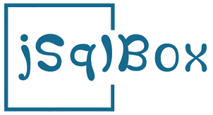
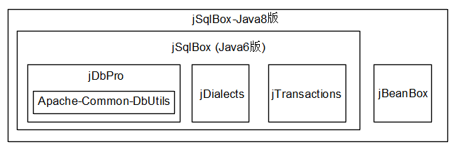

<p align="left">
  <a href="README_ENG.md">
	English instructions please see "README_ENG.md"
  </a>
</p>

<p align="center">
  <a href="https://github.com/drinkjava2/jsqlbox">
   
  </a>
</p>

<p align="center">
  基于DbUtils内核的全功能数据库持久层工具
</p>

<p align="center">
  <a href="http://search.maven.org/#search%7Cga%7C1%7Cg%3A%22com.github.drinkjava2%22%20AND%20a%3A%22jsqlbox%22">
    
  </a>

  <a href="https://www.apache.org/licenses/LICENSE-2.0">
    
  </a>
</p>

## 简介 | Intro
jSqlBox是一个全功能开源Java数据库持久层工具，在架构、功能、易用性等方面都不输于其它持久层工具，可以说，只要是与数据库操作相关的功能，jSqlBox都已具备，如DDL操作、分页、分库分表、声明式事务、分布式事务、关联映射查询等，所有这些功能都包含在一个1M大小的jar包中，不依赖任何第三方库。 

## 与其它持久层工具对比
请见[与其它DAO工具对比](https://gitee.com/drinkjava2/jsqlbox/wikis/pages?sort_id=1010925&doc_id=92178), 可以对jSqlBox的功能与特点有一个大概的了解。  

## 架构 | Architecture  
  

## 优点 | Advantages

- **架构合理**：模块式架构，各个模块都可以脱离jSqlBox单独存在。  
- **跨数据库**：基于jDialects，支持80多种数据库的分页、DDl脚本生成、从数据库生成实体源码、函数变换、主键生成等功能。  
- **与DbUtils兼容**：内核基于DbUtils, 原有基于DbUtils的旧项目可以无缝升级到jSqlBox。  
- **多种SQL写法**：Inline方法、模板方法、DataMapper、ActiveRecord、链式写法等。  
- **多项技术创新**：Inline风格、多行文本支持、实体关联查询、树结构查询等。  
- **动态配置**：除了支持实体Bean注解式配置，jSqlBox还支持在运行期动态更改配置。  
- **无会话设计**：无会话设计(Sessionless)，是一个真正轻量级的、全功能的持久层工具，也可以作为其它持久层工具的补丁来使用。  
- **主从、分库分表**：无需引入第三方工具，jSqlBox本身就具备主从、分库分表功能。  
- **自带声明式事务**：内置微型IOC/AOP工具，不依赖Spring就可提供声明式事务。  
- **自带分布式事务**：无需引入第三方工具，jSqlBox本身就提供无侵入的分布式事务功能，和Seata项目类似，它可以自动生成回滚SQL，但源码远比Seata简洁。
- **学习曲线平滑**：模块化学习，了解了各个子模块，就掌握了jSqlBox，jSqlBox主体模块源码只有40多个类。  
 
## 文档 | Documentation

[中文](https://gitee.com/drinkjava2/jsqlbox/wikis/pages) | [English](https://github.com/drinkjava2/jsqlbox/wiki) | [JavaDoc](http://search.maven.org/#search%7Cga%7C1%7Ca%3A%22jsqlbox%22) | [PDF](https://gitee.com/drinkjava2/jsqlbox/wikis/pages/export?type=pdf&info_id=92178)

## 配置 | Configuration
在pom.xml中加入：  
```xml
<dependency>
   <groupId>com.github.drinkjava2</groupId>
   <artifactId>jsqlbox</artifactId>  
   <version>4.0.3.jre8</version> <!-- 或最新版 -->
</dependency> 
```
jSqlBox分为Java8和Java6两个版本发布，如果是Java6或7环境下，请将版本号改为4.0.1.jre6，Java8和Java6版本的主要区别是Java8版的实体类可以只声明ActiveEntity接口就可以进行CRUD操作了，并且Java8版提供了利用Lambda写支持重构的SQL的功能。对于新项目开发，请尽量使用Java8版本。
另一种使用jSqlBox的方式是：因为它没有用到第三方依赖，对于需要学习或更改它的源码的场合，也可以直接将jSqlBox的源码拷到项目目录里就可以直接使用它了。  

## 入门 | First Example
以下示例演示了jSqlBox的基本配置和使用:
```
pom.xml中引入：
    <dependency>
      <groupId>com.github.drinkjava2</groupId>
       <artifactId>jsqlbox</artifactId> 
       <version>4.0.2.jre8</version> <!-- Java8版 -->
    </dependency>

    <dependency>
      <groupId>com.h2database</groupId>
      <artifactId>h2</artifactId> <!--H2内存数据库-->
      <version>1.3.176</version>
    </dependency>

在IDE里输入以下源程序：

import javax.sql.DataSource;
import org.h2.jdbcx.JdbcConnectionPool;
import static com.github.drinkjava2.jsqlbox.DB.*;
import com.github.drinkjava2.jdialects.annotation.jdia.UUID25;
import com.github.drinkjava2.jdialects.annotation.jpa.Id;
import com.github.drinkjava2.jsqlbox.*; 
public class HelloWorld implements ActiveEntity<HelloWorld> {
	@Id
	@UUID25
	private String id;

	private String name;

	public String getId() {
		return id;
	}

	public void setId(String id) {
		this.id = id;
	}

	public String getName() {
		return name;
	}

	public HelloWorld setName(String name) {
		this.name = name;
		return this;
	}

	public static void main(String[] args) {
		DataSource ds = JdbcConnectionPool //这个示例使用h2内存数据库
				.create("jdbc:h2:mem:DBNameJava8;MODE=MYSQL;DB_CLOSE_DELAY=-1;TRACE_LEVEL_SYSTEM_OUT=0", "sa", "");
		DbContext ctx = new DbContext(ds);
		ctx.setAllowShowSQL(true); //开启SQL日志输出
		DbContext.setGlobalDbContext(ctx); //设定全局DbContext
		ctx.quiteExecute(ctx.toDropAndCreateDDL(HelloWorld.class)); //从实体创建DDL，创建表格
		HelloWorld h = new HelloWorld().setName("Foo").insert().putField("name", "Hello jSqlBox").update();
		System.out.println(DB.iQueryForString("select name from HelloWorld where name like ?", param("H%"), " or name=",
				ques("1"), " or name =?", param("2")));
		h.delete(); //删除实体
		ctx.executeDDL(ctx.toDropDDL(HelloWorld.class)); //删除表格
	}
}
```
上面这个演示包括了根据实体类生成DDL并执行、插入实体到数据库、执行更新、查询出结果、即打印出"Hello jSqlBox"、删除实体、删除数据库。
示例中的实体类只需要声明接口(限Java8版)。查询语句使用了jSqlBox独创的参数内嵌式SQL写法，可以自由拼接复杂的条件SQL，也不用考虑参数和问号对齐的问题了。  
因为开启了日志输出，可以看到命令行打印出的SQL执行日志:
```
SQL: drop table HelloWorld if exists
PAR: []
SQL: create table HelloWorld ( id varchar(250),name varchar(250), primary key (id))
PAR: []
SQL: insert into HelloWorld (name, id)  values(?,?)
PAR: [Foo, emeai4bfdsciufuuteb9a7nmo]
SQL: update HelloWorld set name=?  where id=?
PAR: [Hello jSqlBox, emeai4bfdsciufuuteb9a7nmo]
SQL: select name from HelloWorld where name like? or name=? or name =?
PAR: [H%, 1, 2]
SQL: delete from HelloWorld where id=? 
PAR: [emeai4bfdsciufuuteb9a7nmo]
SQL: drop table HelloWorld if exists
PAR: []
```
以上是jSqlBox最简短的入门介绍，详细的使用说明请参见[用户手册](https://gitee.com/drinkjava2/jsqlbox/wikis/pages)。  

## 范例 | Demo
以下范例位于jSqlBox的demo目录下：  
* [jbooox](../../tree/master/demo/jsqlbox-jbooox) 这是一个微型Web演示项目，基于三个开源项目jBeanBox、jSqlBox、jWebBox的整合。
* [jsqlbox-actframework](../../tree/master/demo/jsqlbox-actframework) 演示jSqlBox与ActFramework框架的整合，分别展示利用jBeanBox和Guice来实现声明式事务。
* [jsqlbox-jfinal](../../tree/master/demo/jsqlbox-jfinal) 演示jSqlBox与jFinal的整合，用jSqlBox替换掉jFinal自带的DAO工具。
* [jSqlBox-Spring](../../tree/master/demo/jsqlbox-spring) 演示jSqlBox在Spring+Tomcat环境下的配置和使用
* [jsqlbox-springboot](../../tree/master/demo/jsqlbox-springboot) 演示jSqlBox在SpringBoot环境下的配置和使用。  
* [jsqlbox-mybatis](../../tree/master/demo/jsqlbox-mybatis) 演示在SpringBoot环境下jSqlBox和MyBatis的混合使用。
* [jsqlbox-beetl](../../tree/master/demo/jsqlbox-beetl) 演示如何在jSqlBox中自定义SQL模板引擎，此演示使用Beetl作为SQL模板。
 
## 相关开源项目 | Related Projects
- [数据库方言工具 jDialects](https://gitee.com/drinkjava2/jdialects)
- [独立的声明式事务工具 jTransactions](https://gitee.com/drinkjava2/jTransactions)
- [微型IOC/AOP工具 jBeanBox](https://gitee.com/drinkjava2/jBeanBox)
- [前端直接写SQL和业务逻辑 GoSqlGo](https://gitee.com/drinkjava2/gosqlgo)

## 期望 | Futures

欢迎发issue提出更好的意见或提交PR，帮助完善项目

## 版权 | License

[Apache 2.0](http://www.apache.org/licenses/LICENSE-2.0)

## 关注我 | About Me
[码云](https://gitee.com/drinkjava2)  
[Github](https://github.com/drinkjava2)  
